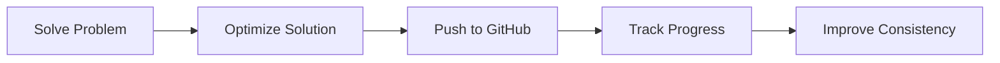

<h1 align="center">
  🚀 DSA Mastery Repository
</h1>

<p align="center">
  
</p>

---

<p align="center">
  <a href="https://github.com/Student-Pavan/DSA_">
    
  </a>
  
  <a href="https://github.com/Student-Pavan/DSA_/commits/main">
    
  </a>

  <a href="https://github.com/Student-Pavan/DSA_/stargazers">
    
  </a>

  <a href="https://github.com/Student-Pavan/DSA_/network/members">
    
  </a>

  

  

</p>


# 🌟 About This Repository

> This repository documents my complete **Data Structures & Algorithms** journey with consistent daily problem solving and optimized Java solutions.

I solve problems regularly from:

<div align="center">

| Platform | Focus |
|----------|-------|
| 🟡 **LeetCode** | Interview Preparation |

</div>

---

# 🎯 Goals

<div align="center">

| ✅ Objective | 🚀 Description |
|---|---|
| Problem Solving | Improve logical thinking |
| DSA Mastery | Learn advanced concepts |
| Interview Prep | Crack coding interviews |
| Daily Consistency | Maintain discipline |
| Optimization | Write efficient Java code |

</div>

---

# 🧠 Topics Covered

<div align="center">

## 🔹 Fundamentals
</div>

<p align="center">
  
</p>

<table align="center">
<tr>
<td align="center" width="250">

### 📘 Basics
Arrays  
Strings  
Recursion  
Mathematics  
Bit Manipulation  

</td>

<td align="center" width="250">

### 📦 Data Structures
Stack  
Queue  
Linked List  
HashMap  
Heap  
Tree  
Graph  

</td>

<td align="center" width="250">

### ⚡ Algorithms
Sorting  
Searching  
Sliding Window  
Greedy  
Backtracking  
Dynamic Programming  

</td>
</tr>
</table>

---

# 📈 Progress Tracker

<p align="center">

| Topic | Status |
|---|---|
| Arrays | 🟢 Completed |
| Strings | 🟢 Completed |
| Stack & Queue | 🟡 In Progress |
| Trees | 🟡 In Progress |
| Graphs | 🔵 Learning |
| Dynamic Programming | 🔥 Mastering |

</p>

---

# 📂 Repository Structure

```bash
DSA_/
│
└── leetcode-solutions/
    ├── 3Sum/
    ├── Baseball Game/
    ├── Basic Calculator II/
    ├── Binary Search/
    ├── Binary Tree Inorder Traversal/
    ├── Binary Tree Level Order Traversal/
    ├── Binary Tree Postorder Traversal/
    ├── Binary Tree Preorder Traversal/
    ├── Build Array from Permutation/
    ├── Climbing Stairs/
    ├── Container With Most Water/
    ├── Contains Duplicate/
    ├── Continuous Subarray Sum/
    └── ...
    │
    └── README.md
```

---

# 🚀 Daily Practice Workflow



---

# 📌 Repository Highlights

- ✅ Clean Java Solutions
- ✅ Optimized Approaches
- ✅ Beginner Friendly Code
- ✅ Consistent Daily Updates
- ✅ Structured Folder Organization
- ✅ Interview Preparation Focused

---

# 💻 Tech Stack

<p align="center">
  
</p>


# 🌐 Connect With Me

<p align="center">

<a href="https://github.com/Student-Pavan">
  
</a>

</p>

---

<h3 align="center">
⭐ Consistency + Practice + Discipline = DSA Mastery ⭐
</h3>

<p align="center">
  
</p>
